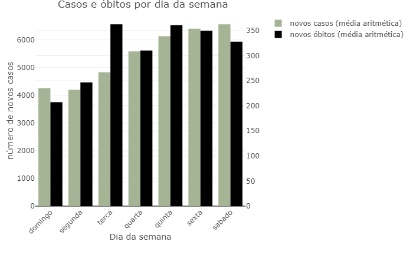
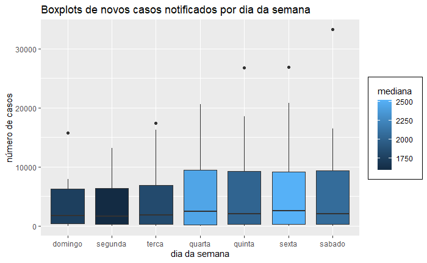
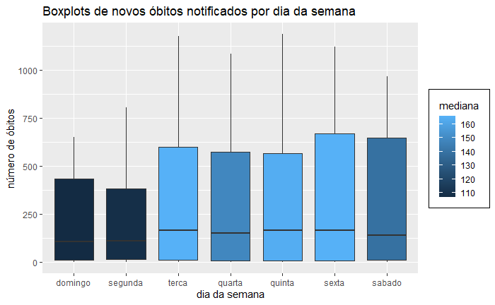

As seguintes visualizações, feitas com ggplot e plotly (em R) resumem a tendência de notificações de novos casos e óbitos de covid-19 por dia da semana no Brasil. O código detalhado e uma discussão mais completa do assunto podem ser encontrados nos arquivos R-Markdown e HTML nessa pasta.

Domingo e segunda aparentam ser os dias quando há menos notificações de casos e óbitos no geral, mas ainda é preciso fazer testes estatísticos de comparação para confirmar isso.

De qualquer maneira, é importante ter essa possível diferença entre dias da semana em mente ao analisar dados e fazer projeções da covid-19 no Brasil. Por exemplo, ao calcular taxas de crescimento, devemos tentar usar períodos que incluam semanas inteiras (e não pedaços de uma semana), e assim tentar diluir o efeito das diferenças nas notificações ao longo da semana. 
